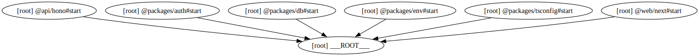

## Architecture and Tech Stack



- **Runtime & Build System**: [Bun](https://bun.sh) + [Turborepo](https://turbo.build)
- **Frontend**: [Next.js 16](https://nextjs.org)
- **Backend**: [Hono](https://hono.dev)
- **RPC**: [Hono Client](https://hono.dev/docs/guides/rpc) for end-to-end type safety with frontend client
- **Database**: [PostgreSQL](https://www.postgresql.org) with [Drizzle ORM](https://orm.drizzle.team)
- **Authentication**: [Better Auth](https://better-auth.com)
- **Styling**: [Tailwind CSS](https://tailwindcss.com)
- **UI Components**: [Shadcn UI](https://ui.shadcn.com)
- **Data Fetching**: [TanStack Query](https://tanstack.com/query/latest)
- **Validation**: [Zod](https://zod.dev)
- **Linting & Formatting**: [Oxlint](https://oxc.rs/docs/guide/usage/linter) + [Prettier](https://prettier.io)
- **Documentation**: [Fumadocs](https://fumadocs.dev) with auto-generated [llms.txt](https://zerostarter.dev/llms.txt)

### Future Stack and Features

- **AI**
  - [ ] [Vercel AI SDK](https://ai-sdk.dev)
- **Analytics**:
  - [ ] [Posthog](https://posthog.com)
- **Background Tasks**:
  - [ ] [Inngest](https://www.inngest.com)
  - [ ] [Trigger.dev](https://trigger.dev)
- **Email**:
  - [ ] [Resend](https://resend.com)
  - [ ] [SendGrid](https://sendgrid.com)
- **OpenAPI**:
  - [ ] [Scalar](https://scalar.com)
- **Organization/teams**:
  - [ ] [Better Auth](https://www.better-auth.com/docs/plugins/organization)
- **Internationalization**:
  - [ ] [i18next](https://www.i18next.com)
  - [ ] [next-intl](https://next-intl.dev)
- **Payment Processing**:
  - [ ] [Autumn](https://useautumn.com)
  - [ ] [Creem](https://www.creem.io)
  - [ ] [Dodo](https://dodopayments.com)
  - [ ] [Lemon Squeezy](https://www.lemonsqueezy.com)
  - [ ] [Paddle](https://www.paddle.com)
  - [ ] [Polar](https://polar.sh)
  - [ ] [Razorpay](https://razorpay.com)
  - [ ] [Stripe](https://stripe.com)

---

## Project Structure

This project is a monorepo organized as follows:

```
.
├── api/
│   └── hono/      # Backend API server (Hono)
├── web/
│   └── next/      # Frontend application (Next.js)
└── packages/
    ├── auth/      # Shared authentication logic (Better Auth)
    ├── db/        # Database schema and Drizzle configuration
    ├── env/       # Type-safe environment variables
    └── tsconfig/  # Shared TypeScript configuration
```

---

## Type-Safe API Client

This starter utilizes [Hono RPC](https://hono.dev/docs/guides/rpc) to provide end-to-end type safety between the backend and frontend.

- **Backend**: Routes defined in `api/hono/src/routers` are exported as `AppType` at `api/hono/src/index.ts`.
- **Frontend**: The client at `web/next/src/lib/api/client.ts` infers `AppType` request/response types using `hono/client`.

### Usage Example

```ts
import { apiClient } from "@/lib/api/client"

// Fully typed request and response
const res = await apiClient.health.$get()
const data = await res.json()
```

---

## Getting Started

### Prerequisites

- [Bun](https://bun.sh) (v1.3.0 or later)

### Installation

1. Clone this template:

   ```bash
   bunx gitpick https://github.com/nrjdalal/zerostarter
   cd zerostarter
   ```

2. Install dependencies:

   ```bash
   bun install
   ```

   > **Note**: If the installation fails, try using `bun install --ignore-scripts`

3. Set up environment variables:

   Create a `.env` file in the root directory with the following variables:

   ```
   # -------------------- Server variables --------------------

   HONO_APP_URL=http://localhost:4000
   HONO_TRUSTED_ORIGINS=http://localhost:3000

   # Generate using `openssl rand -base64 32`
   BETTER_AUTH_SECRET=

   # Generate at `https://github.com/settings/developers`
   GITHUB_CLIENT_ID=
   GITHUB_CLIENT_SECRET=

   # Generate using `bunx pglaunch -k`
   POSTGRES_URL=

   # -------------------- Client variables --------------------

   NEXT_PUBLIC_APP_URL=http://localhost:3000
   NEXT_PUBLIC_API_URL=http://localhost:4000
   ```

### Database Setup

1. Ensure your PostgreSQL server is running.
2. Run the generation:

   ```bash
   bun run db:generate
   ```

3. Run the migration:

   ```bash
   bun run db:migrate
   ```

### Authentication Setup

This starter uses [Better Auth](https://better-auth.com) with GitHub as the provider.

1. Create a GitHub OAuth App at [GitHub Developer Settings](https://github.com/settings/developers).
2. Set the **Homepage URL** to `http://localhost:3000`.
3. Set the **Authorization callback URL** to `http://localhost:3000/api/auth/callback/github`.
4. Copy the **Client ID** and **Client Secret** into your `.env` file.

### Running the Application

```bash
bun dev
```

### Running the Application with Docker Compose

```bash
docker compose up
```

### Accessing the Application

- Frontend: [http://localhost:3000](http://localhost:3000)
- Backend: [http://localhost:4000](http://localhost:4000)

---

## Scripts

### Development

- `bun run dev`: Start the development servers.

### Maintenance

- `bun run clean`: Clean the cache and build artifacts.
- `bun run lint`: Lint the codebase using Oxlint.
- `bun run format`: Format the codebase using Prettier.
- `bun run check-types`: Check the types of the codebase.

### Production

- `bun run build`: Build the applications.
- `bun run start`: Start the production servers.

### Database

- `bun run db:generate`: Generate Drizzle migrations.
- `bun run db:migrate`: Run Drizzle migrations.
- `bun run db:studio`: Open Drizzle Studio to view/edit data.

## Deployment

- **Frontend**:
  - [Vercel](/docs/deployment/vercel#vercel)
- **Backend**:
  - [Vercel](/docs/deployment/vercel#vercel-1)

## Contributing

Contributions welcome — any help is appreciated!

- Fork the repo and create a branch (use descriptive names, e.g. `feat/{name}` or `fix/{name}`).
- Make your changes, add tests if applicable, and run the checks:
  - `bun run build`
  - `bun run check-types`
  - `bun run format`
  - `bun run lint`
- Follow the existing code style and commit message conventions (use conventional commits: feat, fix, docs, chore).
- Open a PR describing the change, motivation, and any migration notes; link related issues.
- For breaking changes or large features, open an issue first to discuss the approach.
- By contributing you agree to the MIT license and the project's Code of Conduct.

Thank you for helping improve ZeroStarter!

## License

This project is licensed under the [MIT](https://github.com/nrjdalal/zerostarter/blob/canary/LICENSE.md) License.
